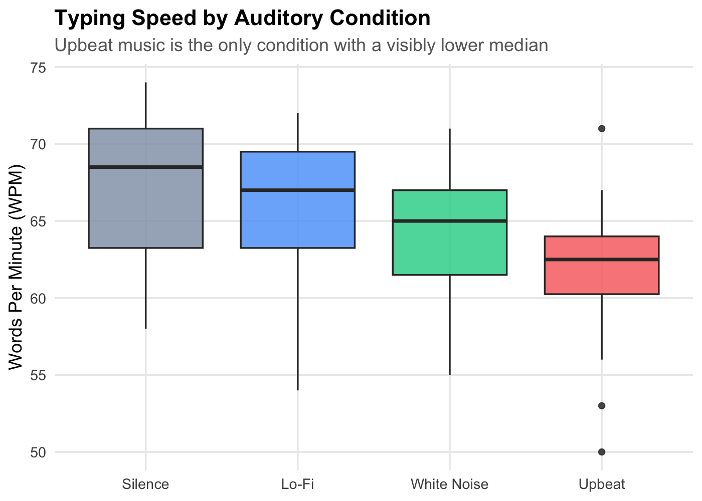
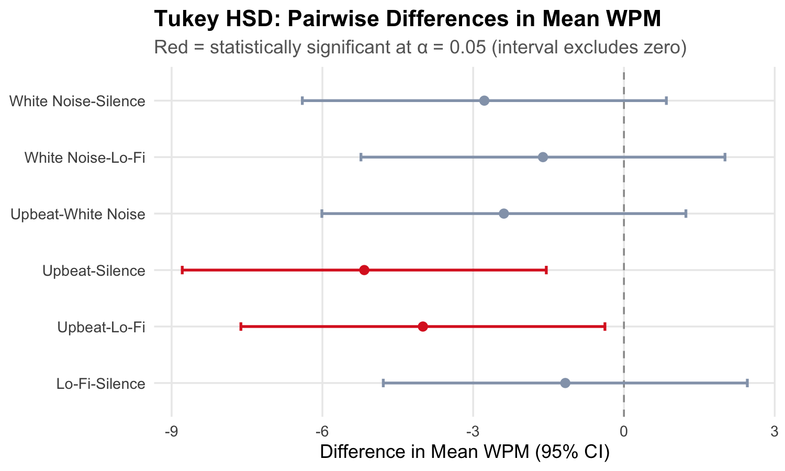
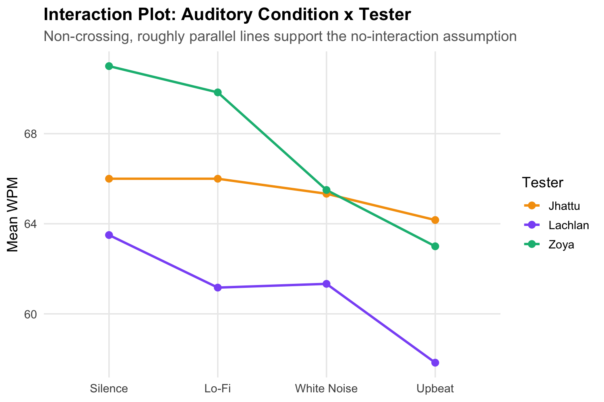

# Does Sound Affect Typing Speed?

Investigating whether background audio affects typing performance, using a Completely Randomized Block Design (CRBD) in R.

**Course:** STAT 425 — Experimental Design, University of Calgary (April 2026)
**Team:** Zoya Malik, Manreet Kaur Jhattu, Lachlan Findlay

---

## The Question

Many people listen to music or background audio while working at a computer, on the assumption that it helps (or at least doesn't hurt) performance. We tested this directly: does *what* you listen to while typing change how fast you type?

## Study Design

Three team members each completed one-minute typing tests (via [Monkeytype](https://monkeytype.com)) under four auditory conditions — **Upbeat music, Lo-Fi music, White Noise, and Silence** — with condition order randomized per session to control for fatigue and carry-over effects. Each tester completed 2 replications × 3 trials per condition, for **3 testers × 4 conditions × 2 replications × 3 trials = 72 total observations**, collected over two weeks (March 18–28, 2026).

Tester was modeled as a **blocking factor**, not a nuisance to average away: baseline typing speed differs a lot between individuals, and blocking on tester removes that variance from the error term, giving a more powerful test of the thing we actually care about — the effect of audio.

**Model:**

$$Y_{ij} = \mu + \tau_i + \beta_j + \varepsilon_{ij}$$

where τᵢ is the effect of the *i*-th auditory condition (fixed, i = 1..4) and βⱼ is the effect of the *j*-th tester (fixed, j = 1..3).

## Key Finding

**Upbeat music is the only condition that slowed typing down — Silence, Lo-Fi, and White Noise were statistically indistinguishable from each other.**



| Condition | Mean WPM |
|---|---|
| Silence | 66.8 |
| Lo-Fi | 65.7 |
| White Noise | 64.1 |
| Upbeat | 61.7 |

A two-way ANOVA (Music + Tester) found both factors significant:

| Source | df | F | p-value |
|---|---|---|---|
| Music (auditory condition) | 3 | 5.30 | 0.0025 |
| Tester (block) | 2 | 15.06 | 4.1 × 10⁻⁶ |

Tukey HSD pairwise comparisons pin the effect down to **Upbeat specifically**: Upbeat vs. Silence (p = 0.0020) and Upbeat vs. Lo-Fi (p = 0.0247) are the only pairs that clear the 0.05 threshold. Upbeat vs. White Noise trends in the same direction but isn't statistically significant (p = 0.31).



Participants typed roughly **4–5 fewer words per minute under Upbeat music** than under the other three conditions — over a full work session, that's the difference of multiple paragraphs.

## Model Diagnostics

CRBD assumes normal residuals, equal variance across conditions, and no treatment-block interaction. All three held:

- **Normality:** Shapiro-Wilk on residuals, W = 0.987, p = 0.648 — no evidence against normality.
- **Equal variance:** Levene's test, F = 0.43, p = 0.730 — variance is consistent across conditions.
- **Additivity:** the interaction plot below shows all three testers follow the same pattern (Upbeat lowest) without lines crossing more than once, supporting no significant treatment × block interaction.



## Limitations

The sample is 3 participants — the study's own authors — which limits how far these results generalize. Accuracy was recorded but not analyzed alongside speed; a faster typist under Upbeat music who also makes more errors would tell a different story than these WPM numbers alone suggest. All trials used the same typing platform, so a learning effect over the two-week collection window is possible despite randomized condition order. And the trials were short (one minute); effects may differ for sustained, real-world typing sessions.

## Repository Structure

```
auditory-performance-analysis/
├── src/
│   └── STAT425_Project_Analysis.Rmd    — full analysis: ANOVA, diagnostics, Tukey HSD
├── data/
│   ├── typing_combined.csv             — merged dataset used in the analysis (n = 72)
│   ├── zoya_data_collection.csv        — raw per-tester data collection
│   ├── manreet_data_collection.csv
│   └── lachlan_data_collection.csv
├── results/                            — figures generated from the analysis
├── report/
│   ├── STAT425_Report.pdf              — full written report
│   ├── STAT425_Presentation.pdf        — presentation slides
│   └── STAT425_Project_Proposal.pdf    — original project proposal
└── README.md
```

## Reproduce This Analysis

```bash
git clone https://github.com/zoya-malik/auditory-performance-analysis.git
cd auditory-performance-analysis
```

```r
install.packages(c("ggplot2", "mosaic", "car"))
rmarkdown::render("src/STAT425_Project_Analysis.Rmd")
```
